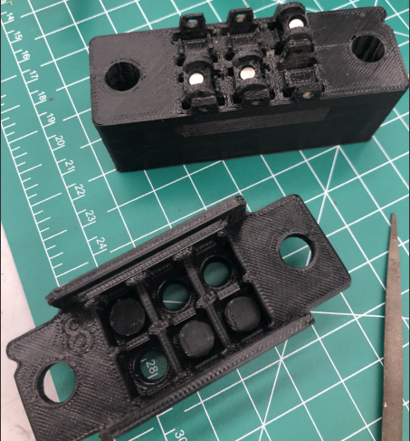
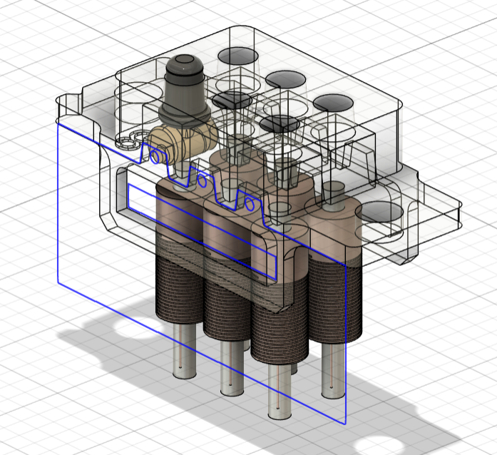
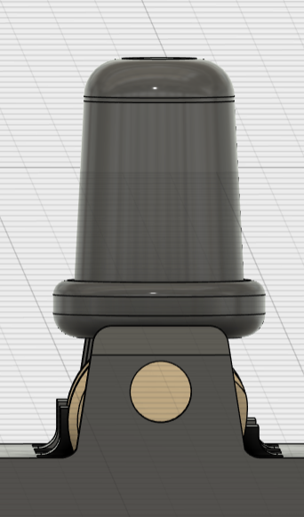
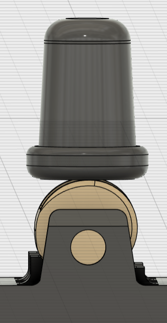
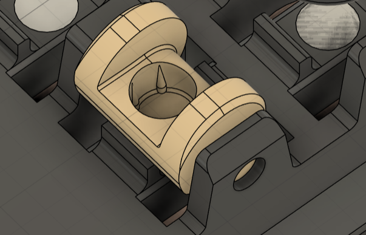
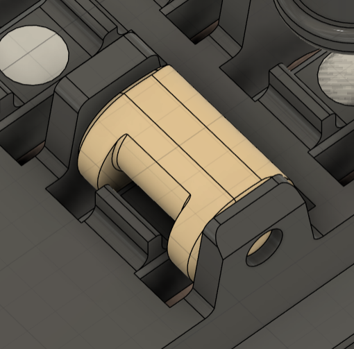

**Contributors:** Sascha Jalinous ‘28, Anna Brown 28’, Sammy '28, and Maya '27

### Sprint Goals
1. Explore feasibility of simple electromagnet actuator mechanism 
2. Create low-tech theoretical prototype
3. Explore feasibility of existing cam mechanism 
4. Prusa 3D print large scale cam mechanism 
5. Explore cam tolerancing
6. Prusa and Resin print toleranced prototype 

### Achieved
- One large hand size 3D printed model printed on Prusa 3D printer
- Two small scale 3D printed models → first one was printed on a prusa, second was printed on a resin printer

### Process
- Original 3D model and tutorial was made by Vijay on hackaday.io (blog linked below)
- Sascha Jalinous ‘28 and Anna Brown 28’ partner CADed the file into a printable format
- Sascha Jalinous ‘28 and Anna Brown 28’ printed it at hand scale on the Prusa and processed it and assembled it 
- Sascha Jalinous ‘28 and Anna Brown 28’ presented the design at sprint review on 2/18/25
- Quinn Veriil ‘27 helped us come up with ideas for what to do after the hand-scale 3D model 
- Sascha Jalinous ‘28 and Anna Brown 28’ co-CADed the tolerances of the cam pins
- Sascha Jalinous ‘28 and Anna Brown 28’ printed it at small scale on the Prusa then processed and assembled it 
- Quinn Verrill ‘27 resin printed and cured our small prototype
- Realized after small scale 3D print: Prusa is not the way 
    - Supports consistently damaged the main parts 
    - Model was too fragile and easy to break whereas the resin was more flexible and less prone to breaking
    - The plastic was easily deformed when we tried to put the cams into the holes 
    - The holes printed wonky
    - Tiny strings of plastic really got in the way of assembly 
    - Pins of cams were very fragile and some broke off with supports
- After this we assembled the print Quinn Verrill ‘27 made in the resin printer 

### Budget Spent

| Item      | Link             | Cost per item | Quantity bought | Total Cost |
|-----------|------------------|---------------|-----------------|------------|
| Black PLA | NA 3D printer    | NA            | 2 prints        | $0         |
| Resin     | NA Resin printer | NA            | 1 print         | $0         |

### Key Takeaways
- Proof of concept
    - This design has been done before 
- Learned that cam mechanism is doable → difficult, but doable 
- Resin printing is the only way this is going to work → can not be done on prusa printers 
    - Difficult to assemble 
    - Lots of small parts
    - Magnets inside the cams have to be very tiny and may need glue
    - Cams have to be put in the correct orientation or else they won’t close properly → it’s difficult to tell which way they go in, so extra time needs to be taken to ensure they’re correct 
- Cams do not need continuous current to keep the pins up → they only need the electromagnets to turn on and off 
- We have not tested whether the electromagnets are strong enough to actually move the cams up and down 
- Tolerancing and friction is still something that we are working on 
    - On our small scale, we found that 0.02in cam pins worked best with the size of our print → the exact size of the pin really depends on the size of the model as a whole so that’s why tolerancing is still something we’re working on 

### Related Documents
- [Vijay Blog and Model: ](https://hackaday.io/project/191181-electromechanical-refreshable-braille-module) https://hackaday.io/project/191181-electromechanical-refreshable-braille-module

- 

*Figure 1: The Big One*

- 

- 

- 

- 

