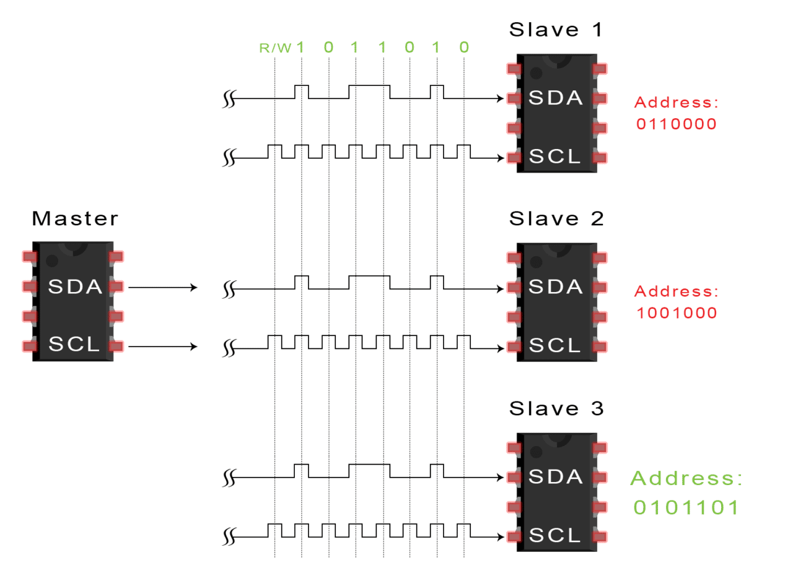
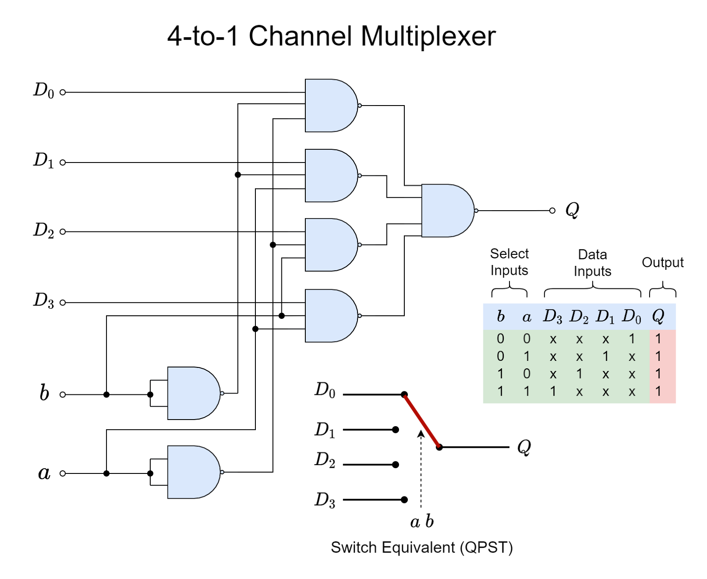

**Contributors:** Toby Mallon ‘27, Laurel Cox ‘27, Antara Mazumdar ‘28, Eleane Lin ‘28, Liam Fries ‘28, and Emily Boyd ‘28

### Sprint Goals
1. Determine how to send data to braille cells

    a. Research several methods

2. Prototype data-sending system
3. Identify design requirements

### Achieved
- Determined method of data sending
    - shift registers
- Identified design requirements

    a. Does not need to be fast 

    - ~ 1 kbps

    b. Scalable

    - Should be easy to add extra registers/cells
    - Adding cells should not substantially change the amount of time needed to refresh
    - Should function with a clock signal in kHz area of magnitude 

    c. Light and compact battery

    - Usable while charging
    - Current e-readers can reach up to 10-20 hours on a single charge

    d. Data:

    - Send either 6 or 8 bits of data to several different reception points 
    - Ability to assign 6-bit strings to different points using registers

- Identified more design questions
    - Individual circuit board or one big one?
    - Buttons? Page turning (forward, backward, select)
    - How do you choose a book on it? + menu
    - Differences in microcontrollers/microprocessors 
    - How to upload?
    - How much storage?

### Process

#### Data Communication

This sprint we started off with a bunch of data communication research to orchestrate communication from the microprocessor to our braille cells and actuators. We approached this by splitting up who researched what and then having a shareout to narrow down our decisions. 

**I2C - Toby**

Not chosen due to having to address 360-480 different cells
- Allows up to 128 different devices on the same wire
- Cells need to be able to know what their address is
- Each cell needs to have an individual address
- Can use multiplexing to have separate I2C busses for say each line of cells
- Multiplexing allows us to have 128 x multiplexer different addresses
- Slow for high data transfer rates but we don't care

- Would need chips for each cell but only two wires for an entire row
- Range of only a few meters

- We could very easily build our own multiplexer
- Comes down to just making sure we have our addresses set correctly

**SPI - Laurel**

Not chosen due to complication, though a daisy chain configuration would’ve worked

- Interface
- clock signal (faster processing)
- MOSI - parent to child
- MISO - child to parent
    - Full duplex - meaning can receive and send data simultaneously
- SS - chip select
    - allows us to send signals to specific children
        - versus I2C requires addresses (might not be an issue, but SPI has that built-in functionality)

| Pros                                                                     | Cons                                                                     |
|--------------------------------------------------------------------------|--------------------------------------------------------------------------|
| full duplex - meaning can receive and send data simultaneously           | requires lots of GPIO pins (but there are workarounds)                   |
| faster than UART & I2C                                                   | Lots of variants when it comes to data modes (but is that really a con?) |
| ubiquitous (extremely common and interfaces with pretty much everything) | short distance (< 1 meter, so not relevant for our project)              |

**Serial RS485 - Eleane**

Not chosen due to the small device limit (not enough for all the braille cells)

- Long cabling lengths (not needed for our purposes)
- Can use in electrically noisy environments (not needed for our purposes)
- High speed (not needed for our purposes)
- Allows multiple devices on the same bus - good for data splitting
    - But the device limit is only 32
- Used in most applications requiring a serial interface (which sends data one by one in a stream of bits sequentially): robotics, motor drives, video surveillance – so mostly for communication between multiple devices or systems

**Parallel bus - Emily**

Not chosen due to the sheer number of wires used.

- Super fast
- Would need a separate wire for each cell at least
- Sometimes takes up more space
- The length of cables might create crosstalk or interference

After talking to James Jaegelski ‘25, he dissuaded the use of any of the data sharing strategies we research because it was over complicated. Instead, he pointed to a simpler method similar to that used by LED display panels. So, we chose to use daisy-chained registers for data sharing:

| Pros             | Cons                                        |
|------------------|---------------------------------------------|
| Simple           | Relatively slow                             |
| Cheap            | Possible data loss                          |
| Easy to scale up | Requires more dedicated space for each cell |

#### Challenges

- Sizing of system
- Much of what we researched was either not feasible or over-complicated for the amount of information we needed to send
- Toby bought the wrong components for prototyping

### Budget Spent

| Item                                           | Link                                                                                  | Cost per item | Quantity bought | Total Cost |
|------------------------------------------------|---------------------------------------------------------------------------------------|---------------|-----------------|------------|
| SN74HC595DR IC 8BIT SHIFT REG 3ST-OUT 16SOIC   | https://www.digikey.com/en/products/detail/texas-instruments/SN74HC595DR/562919       | $0.16         | 25              | $4.00      |
| CY74FCT2574CTSOC IC FF D-TYPE SNGL 8BIT 20SOIC | https://www.digikey.com/en/products/detail/texas-instruments/CY74FCT2574CTSOC/1508664 | $0.474        | 25              | $11.85     |
| SN74HC74DR IC FF D-TYPE DUAL 1BIT 14SOIC       | https://www.digikey.com/en/products/detail/texas-instruments/SN74HC74DR/276847        | $0.11760      | 25              | $2.94      |
| Shipping + Tax                                 |                                                                                       | $8.16         |                 | $8.16      |
|                                                |                                                                                       |               | Total           | $26.95     |

### Key Takeaways

- We can use register daisy chaining to move small amounts of data at relatively fast speeds

### Related Documents

- [Research Doc](https://docs.google.com/document/d/1j-H7OtH54iyJWe-_MvwCMz1viSeq28TTGDy--KWKJwc/edit?tab=t.0#heading=h.25vkbto01t5t)
- [Sprint 1 Review Slideshow](https://docs.google.com/presentation/d/1-fGk_BuW0JNuEvrhWyrgf0beI8Ya8F1Y5C0MksfteVc/edit#slide=id.p)