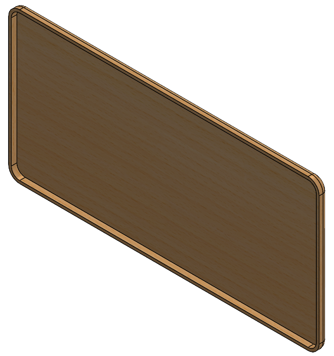
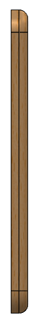

**Contributors:** Camille Kawabata '27

### Sprint Goals
1. Gain a better understanding of existing braille e readers with refreshable displays and find patterns that will be useful to implement in case design.
2. Begin developing spatial understanding of braille cells and the array arrangement sizing.
3. Produce a physical MVP that does not contain braille cells.

### Achieved
- Found patterns in the ergonomic design for existing braille E-readers.
- Used SOLIDWORKS to model braille cell sizing and (poorly) 3D printed a physical representation
- Laser cut a potential top board for the case.
- Completed a CAD model of the tablet-esk version of the e-reader.

### Process
I started my design by looking at existing models. I reasoned that it made no sense to remake the wheel when there were clear instructions of what could be done. This gave me a really jumping off point to begin designing off of. Key features that I noticed were rounded corners and edges, sleek top designs, and many included items such as an attachable lanyard. Based on these features, I began sketching what a model could look like. Initially I was thinking something a bit clunkier than my final as I didn’t (and still don’t) really know how large the actuation components would be nor how much space our electrical system would be. From speaking to Toby, I was given the guidance that skinnier is better, as we would like this to be an easily transportable device. Something that could easily be slipped into a backpack. From here, I slimmed down the design, but left the main components the same. 

I designed off the plan of using a 12 by 40 cell array. This informed the sizing of the unit. I alo planned for the case to be at least two parts. I felt that having a top and bottom component that could be separated would be optimal for repairs and cleanings. Ideally, I would like for this to be something that clicks into place rather than using screws, but this might be the better route to take when thinking of durability.

A challenge I ran into when designing this/creating an MVP was material usage. For the curved and sleek design I was going for, using cardboard or hardboard wasn’t necessarily going to be my best bet, but I also didn’t want to use the 3D printers to create something that was likely not going to be used beyond the design review. Also the size of the case exceeds the max capacity of most of the tools I know how to use, but this made me think about how we can make portions of this in a modular way. This is why I really only cut the top board as a visual representation for the team to recognize how limited our space will be working at a standard braille sizing.

Going into the next sprint, I do still have some questions I would like to look into

- What would be our ideal way to manufacture our case?
- When someone is using our e-reader how are we expecting them to use it? In their lap or on a table?
- What kinds of buttons and ports do we think we’ll be using? How can we arrange them in a logical way to make the e-reader more intuitive?
- Are there ways I can design the case to help orient the user?
- Are there ideal weight guidelines to be within for a handheld device such as this?

### Key Takeaways
- I enjoyed the autonomy I felt that I had while working on this project. I think being on a team of my own makes it so I can’t really hide behind my teammates and push off work. If I don’t get it done, it's not getting done and I think this helps me actually do the work for a project team, unlike my previous experiences.

### Related Documents

