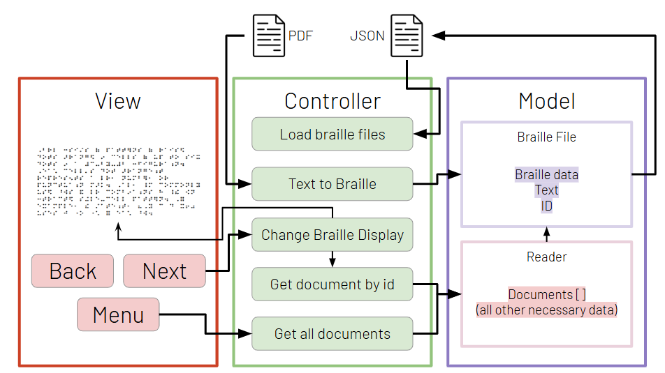
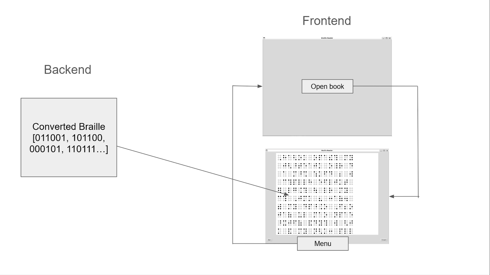

**Contributors:** Bill, Anna, Yunzhu, Evi, Pepper, Titi

### Sprint Goals

1. Select and build a solid code architecture
2. Convert text/pdf files to braille format 
3. Digital model of User Interface for software testing

### Achieved

- Developed a basic front-end UI for testing the controller functions 
- Created basic functions for the controller (forward and backward, access main menu and submenus)
- Implemented a conversion system to convert text files to braille
- Developed a model to store converted files with both original text and braille text

### Process

#### Software Architecture

The first step of the sprint is to select a software architecture. The three criterias to select our architecture are (1) modularity, (2) ease-of-testing, and (3) light-weight. The first criteria arose due to the fact that for the first two sprints, we will be developing software without a physical user-interface. Therefore, we have to make code that isn’t rigidly connected to the architecture, allowing us to move it to another ecosystem when the hardware components are ready to be integrated. For the second criteria, without a physical user-interface, we decided to proceed with a digital twin of the expected final physical user-interface. This allows us to test how our functions will interact with the actual device. The limitation is that it will always be a digital imitation. We won’t be able to intuitively understand how the physical product would function. But it is the best imitation we can make without a physical user-interface. For backend-heavy functions, we will create unit tests to examine a breadth of possible scenarios. As for the last criteria, the software will probably be running on a microcomputer with 1 to 2 GB of RAM. Furthermore, we will not have lots of storage space– up to about 8 GB (which is more than enough). Thus, the architecture must not be too complex and involve too many layers. With the criterias in mind, we selected the Model-View-Controller (MVC) architecture. 

In terms of modularity, this architecture allows us to split our code into three different parts that do not heavily rely on each other. The Model portion is where we will define the structure of the data that we will be using. The Controller portion is where the “thinking” happens. It includes functions that will manipulate the data stored in the model, interact with the View, and connect the data from the Model to the View. The View portion is strictly the user-interface. In the next two sprints, our View will be digital. However, as we move into the integration phase with other subteams, the View will change into the physical product. The MVC allows us to focus on developing the essential code that we need in the Model and Controller, and have as little of what we need in the View. We can simply then replace the digital version of the View with the physical version of the View, while keeping all our progress in the Model and Controller. 

With regards to testing, the MVC architecture allows us to test two different types of Controller functions: the backend functions and the frontend functions. The backend functions are those that will strictly work in the background, for eg. converting a text file into braille format. Since all of these functions will be in the Controller portion, we can easily organize and create unit tests for them. The frontend functions are those that interact with the View. Our plan is to create functions in the View that are universal to both the digital and physical versions, for eg. nextPage(). In the digital version, this could manifest as a button that says next. In the physical version, this could be a button with braille dots on them. Either way, when the function is called, it will call a Controller function. We can then see if the Controller is doing what it’s supposed to do, such as going to the next page of text/braille. The limitation to this method is that it would be painstaking to test all scenarios and not as efficient as unit testing, leading to possible bugs. To compensate, we will try to test as many things using unit tests as possible.

#### Workflow

For this sprint, we will be working in two smaller teams: frontend and backend. The frontend team is in charge of developing the digital user-interface. The backend team is in charge of developing functions in the Controller that take in .txt files and turn them into braille format. As the backend team develops their functions, they will also shape the Model in whatever ways they deem fit.

All of our code is on the software repository of the ORBITAL-Assistive-Tech Github organization. The repository has three branches: main, test_ui, and upload. The main branch includes the most up-to-date code that is reflective of the whole sub team's current progress. For this sprint, the main branch includes code that will start up a digital user-interface with buttons that the user can interact with. Buttons are mapped to functions in the Controller that interacts with the Model. The other two branches are for developing new features. The frontend team works on the test_ui branch. This branch includes the most up-to-date version of the digital user-interface. The backend team works on the upload branch. This branch includes the most up-to-date version of the Controller and Model.

When one of the teams feel like their work is complete, they can submit a pull request in which the sub team lead can accept/reject. The sub team lead is in charge of resolving conflicts in the main branch and making sure that everything integrates properly.

#### Text to Braille Conversion (controller)

Evi, Pepper, and Titi worked on developing the back end systems. We implemented the pybrl library into the project, allowing us to take text strings and convert them into Grade 2 Braille. We built on this by making a system to take input from a txt file, translate it, and store it locally within a dictionary for quick retrieval.

#### Storing Data (model)

The Model was continuously built on throughout the sprint to accommodate the needs of the frontend and backend teams. We did not initially settle on a fixed design for the Model as we believed that there will be new information that’ll have to be stored as the project proceeds. However, we did decide on an overall guiding structure.

To represent the braille e-reader itself, we created a class named Reader which stores all information concerning the operation of the device, such as its battery percentage, current selected document, etc. The Reader class also has a variable named “documents” which is a list containing all of the books, documents, and articles that have been uploaded to the device.

To represent each of these books, documents, and articles, we created a class named BrailleFile. The class contains the text of the document, the text’s braille equivalent, the file path of the original file to the program, and a unique ID which is used to select/identify the file. Whenever a file is uploaded, the Controller will parse it and store the parsed information into an instance of the BrailleFile class. The instance is then stored in the Reader’s “documents” variable.

As the project goes on, we aim to add more variables to these classes as we incorporate new features into the device. Possible ideas we are looking into are ways to represent chapters and book sections in the BrailleFile class, and storing the most recent location the reader was at – so they don’t have to start all over from the beginning of the document. The Reader class could store certain information on preferred settings or some kind of history that the user might find helpful. We hope to keep the model fluid so we can continuously add new features as we rapidly prototype our software.

#### Frontend-UI (view)

Yunzhu and Anna worked on developing the front-end UI. We displayed the braille codes based on the data in the .json file, and created a series of basic but functioning buttons in the controller. We created forward and backward buttons to traverse through the data, and also different subwindows to allow the user to move through the book that is currently being read, and the main menu where they can select other texts they want to read. 

### Key Takeaways

1. Unified English Braille
2. Prevalence of Braille Ready Format (BRF) Files
3. Lack of well-maintained open source Python software 
4. Unreliable nature of PDF/EPUB conversions

### Related Documents

- [Sprint Review Slideshow](https://docs.google.com/presentation/d/1KTW-AqIl8hE7oDpX8LTnE_BcdtSr3teZhLTUPoKvzwk/edit#slide=id.g2d926e0b8df_0_0)
- [Github](https://github.com/ORBITAL-Assistive-Tech/software)