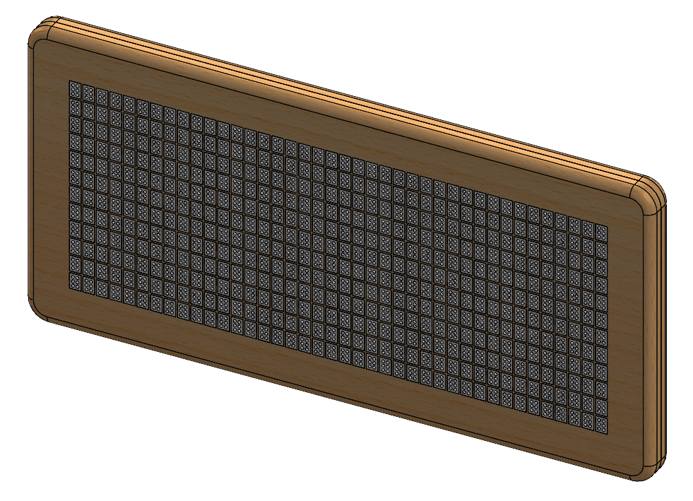
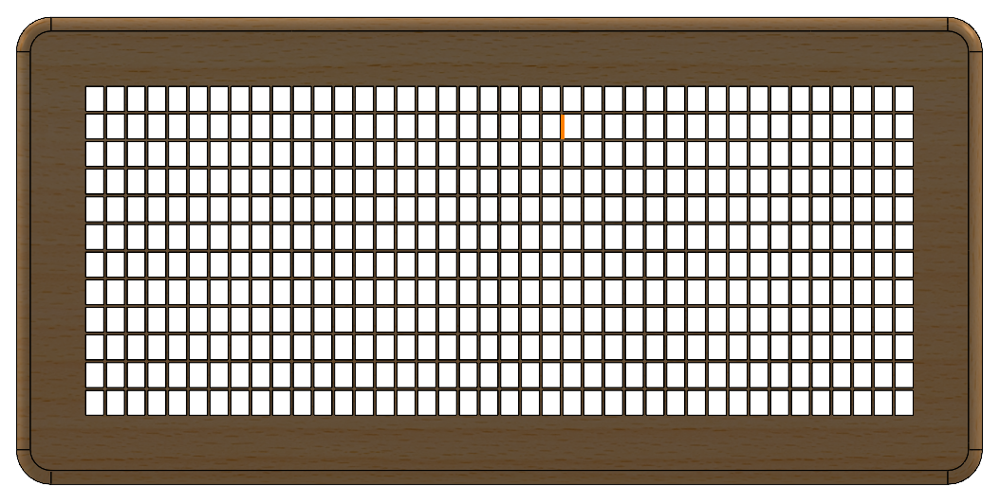
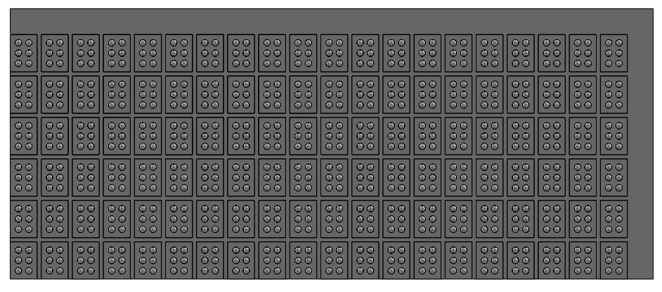
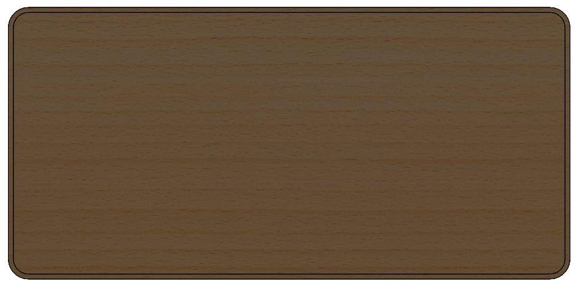
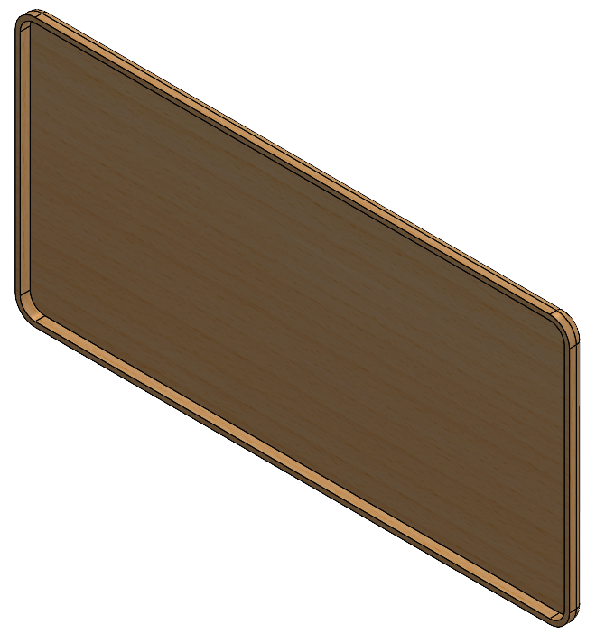
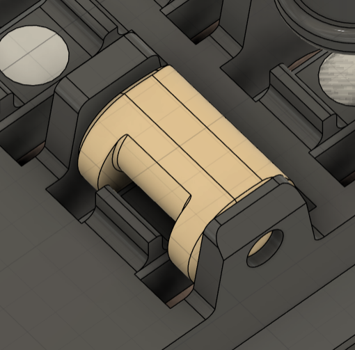
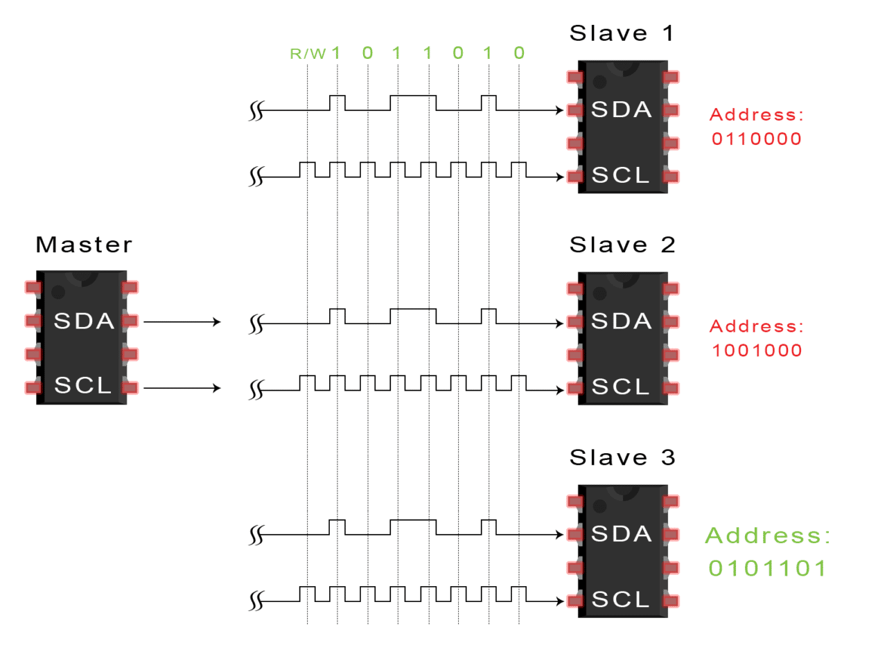
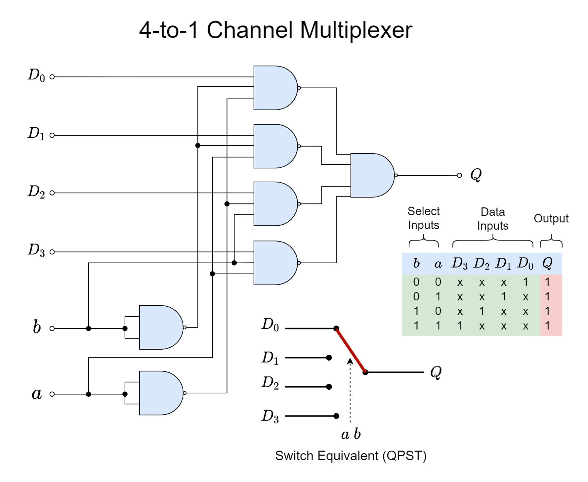
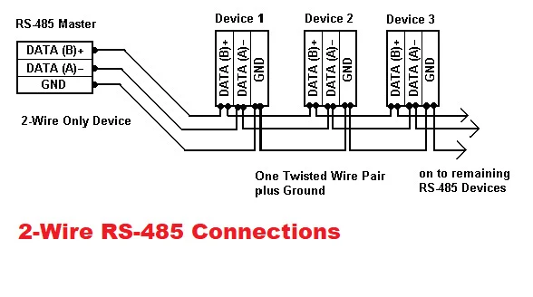
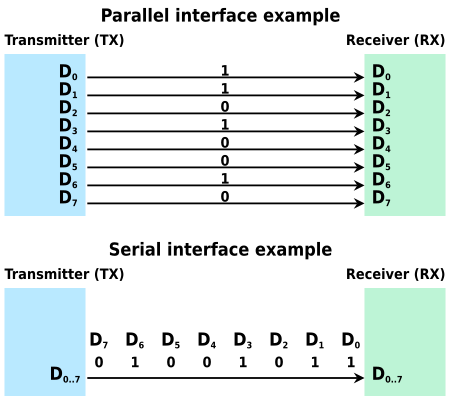

# Sprint Review 1
Sprint date: 02/02/2025 - 02/22/2025

## Form Factor - Mechanical Team

**Contributors:** Camille Kawabata '27

### Sprint Goals
1. Gain a better understanding of existing braille e readers with refreshable displays and find patterns that will be useful to implement in case design.
2. Begin developing spatial understanding of braille cells and the array arrangement sizing.
3. Produce a physical MVP that does not contain braille cells.

### Achieved
- Found patterns in the ergonomic design for existing braille E-readers.
- Used SOLIDWORKS to model braille cell sizing and (poorly) 3D printed a physical representation
- Laser cut a potential top board for the case.
- Completed a CAD model of the tablet-esk version of the e-reader.

### Process
I started my design by looking at existing models. I reasoned that it made no sense to remake the wheel when there were clear instructions of what could be done. This gave me a really jumping off point to begin designing off of. Key features that I noticed were rounded corners and edges, sleek top designs, and many included items such as an attachable lanyard. Based on these features, I began sketching what a model could look like. Initially I was thinking something a bit clunkier than my final as I didn’t (and still don’t) really know how large the actuation components would be nor how much space our electrical system would be. From speaking to Toby, I was given the guidance that skinnier is better, as we would like this to be an easily transportable device. Something that could easily be slipped into a backpack. From here, I slimmed down the design, but left the main components the same. 

I designed off the plan of using a 12 by 40 cell array. This informed the sizing of the unit. I alo planned for the case to be at least two parts. I felt that having a top and bottom component that could be separated would be optimal for repairs and cleanings. Ideally, I would like for this to be something that clicks into place rather than using screws, but this might be the better route to take when thinking of durability.

A challenge I ran into when designing this/creating an MVP was material usage. For the curved and sleek design I was going for, using cardboard or hardboard wasn’t necessarily going to be my best bet, but I also didn’t want to use the 3D printers to create something that was likely not going to be used beyond the design review. Also the size of the case exceeds the max capacity of most of the tools I know how to use, but this made me think about how we can make portions of this in a modular way. This is why I really only cut the top board as a visual representation for the team to recognize how limited our space will be working at a standard braille sizing.

Going into the next sprint, I do still have some questions I would like to look into

- What would be our ideal way to manufacture our case?
- When someone is using our e-reader how are we expecting them to use it? In their lap or on a table?
- What kinds of buttons and ports do we think we’ll be using? How can we arrange them in a logical way to make the e-reader more intuitive?
- Are there ways I can design the case to help orient the user?
- Are there ideal weight guidelines to be within for a handheld device such as this?

### Key Takeaways
- I enjoyed the autonomy I felt that I had while working on this project. I think being on a team of my own makes it so I can’t really hide behind my teammates and push off work. If I don’t get it done, it's not getting done and I think this helps me actually do the work for a project team, unlike my previous experiences.

### Related Documents

## Cam Actuation Exploration - Mechanical Team

**Contributors:** Sascha Jalinous ‘28, Anna Brown 28’, Sammy '28, and Maya '27

### Sprint Goals
1. Explore feasibility of simple electromagnet actuator mechanism 
2. Create low-tech theoretical prototype
3. Explore feasibility of existing cam mechanism 
4. Prusa 3D print large scale cam mechanism 
5. Explore cam tolerancing
6. Prusa and Resin print toleranced prototype 

### Achieved
- One large hand size 3D printed model printed on Prusa 3D printer
- Two small scale 3D printed models → first one was printed on a prusa, second was printed on a resin printer

### Process
- Original 3D model and tutorial was made by Vijay on hackaday.io (blog linked below)
- Sascha Jalinous ‘28 and Anna Brown 28’ partner CADed the file into a printable format
- Sascha Jalinous ‘28 and Anna Brown 28’ printed it at hand scale on the Prusa and processed it and assembled it 
- Sascha Jalinous ‘28 and Anna Brown 28’ presented the design at sprint review on 2/18/25
- Quinn Veriil ‘27 helped us come up with ideas for what to do after the hand-scale 3D model 
- Sascha Jalinous ‘28 and Anna Brown 28’ co-CADed the tolerances of the cam pins
- Sascha Jalinous ‘28 and Anna Brown 28’ printed it at small scale on the Prusa then processed and assembled it 
- Quinn Verrill ‘27 resin printed and cured our small prototype
- Realized after small scale 3D print: Prusa is not the way 
    - Supports consistently damaged the main parts 
    - Model was too fragile and easy to break whereas the resin was more flexible and less prone to breaking
    - The plastic was easily deformed when we tried to put the cams into the holes 
    - The holes printed wonky
    - Tiny strings of plastic really got in the way of assembly 
    - Pins of cams were very fragile and some broke off with supports
- After this we assembled the print Quinn Verrill ‘27 made in the resin printer 

### Budget Spent

| Item      | Link             | Cost per item | Quantity bought | Total Cost |
|-----------|------------------|---------------|-----------------|------------|
| Black PLA | NA 3D printer    | NA            | 2 prints        | $0         |
| Resin     | NA Resin printer | NA            | 1 print         | $0         |

### Key Takeaways
- Proof of concept
    - This design has been done before 
- Learned that cam mechanism is doable → difficult, but doable 
- Resin printing is the only way this is going to work → can not be done on prusa printers 
    - Difficult to assemble 
    - Lots of small parts
    - Magnets inside the cams have to be very tiny and may need glue
    - Cams have to be put in the correct orientation or else they won’t close properly → it’s difficult to tell which way they go in, so extra time needs to be taken to ensure they’re correct 
- Cams do not need continuous current to keep the pins up → they only need the electromagnets to turn on and off 
- We have not tested whether the electromagnets are strong enough to actually move the cams up and down 
- Tolerancing and friction is still something that we are working on 
    - On our small scale, we found that 0.02in cam pins worked best with the size of our print → the exact size of the pin really depends on the size of the model as a whole so that’s why tolerancing is still something we’re working on 

### Related Documents
- [Vijay Blog and Model: ](https://hackaday.io/project/191181-electromechanical-refreshable-braille-module) https://hackaday.io/project/191181-electromechanical-refreshable-braille-module

- 

*Figure 1: The Big One*

- 

- 

- 

- 

## Firmware & Circuit Team

**Contributors:** Toby Mallon ‘27, Laurel Cox ‘27, Antara Mazumdar ‘28, Eleane Lin ‘28, Liam Fries ‘28, and Emily Boyd ‘28

### Sprint Goals
1. Determine how to send data to braille cells

    a. Research several methods

2. Prototype data-sending system
3. Identify design requirements

### Achieved
- Determined method of data sending
    - shift registers
- Identified design requirements

    a. Does not need to be fast 

    - ~ 1 kbps

    b. Scalable

    - Should be easy to add extra registers/cells
    - Adding cells should not substantially change the amount of time needed to refresh
    - Should function with a clock signal in kHz area of magnitude 

    c. Light and compact battery

    - Usable while charging
    - Current e-readers can reach up to 10-20 hours on a single charge

    d. Data:

    - Send either 6 or 8 bits of data to several different reception points 
    - Ability to assign 6-bit strings to different points using registers

- Identified more design questions
    - Individual circuit board or one big one?
    - Buttons? Page turning (forward, backward, select)
    - How do you choose a book on it? + menu
    - Differences in microcontrollers/microprocessors 
    - How to upload?
    - How much storage?

### Process

#### Data Communication

This sprint we started off with a bunch of data communication research to orchestrate communication from the microprocessor to our braille cells and actuators. We approached this by splitting up who researched what and then having a shareout to narrow down our decisions. 

**I2C - Toby**

Not chosen due to having to address 360-480 different cells
- Allows up to 128 different devices on the same wire
- Cells need to be able to know what their address is
- Each cell needs to have an individual address
- Can use multiplexing to have separate I2C busses for say each line of cells
- Multiplexing allows us to have 128 x multiplexer different addresses
- Slow for high data transfer rates but we don't care

- Would need chips for each cell but only two wires for an entire row
- Range of only a few meters

- We could very easily build our own multiplexer
- Comes down to just making sure we have our addresses set correctly

**SPI - Laurel**

Not chosen due to complication, though a daisy chain configuration would’ve worked

- Interface
- clock signal (faster processing)
- MOSI - parent to child
- MISO - child to parent
    - Full duplex - meaning can receive and send data simultaneously
- SS - chip select
    - allows us to send signals to specific children
        - versus I2C requires addresses (might not be an issue, but SPI has that built-in functionality)

| Pros                                                                     | Cons                                                                     |
|--------------------------------------------------------------------------|--------------------------------------------------------------------------|
| full duplex - meaning can receive and send data simultaneously           | requires lots of GPIO pins (but there are workarounds)                   |
| faster than UART & I2C                                                   | Lots of variants when it comes to data modes (but is that really a con?) |
| ubiquitous (extremely common and interfaces with pretty much everything) | short distance (< 1 meter, so not relevant for our project)              |

**Serial RS485 - Eleane**

Not chosen due to the small device limit (not enough for all the braille cells)

- Long cabling lengths (not needed for our purposes)
- Can use in electrically noisy environments (not needed for our purposes)
- High speed (not needed for our purposes)
- Allows multiple devices on the same bus - good for data splitting
    - But the device limit is only 32
- Used in most applications requiring a serial interface (which sends data one by one in a stream of bits sequentially): robotics, motor drives, video surveillance – so mostly for communication between multiple devices or systems

**Parallel bus - Emily**

Not chosen due to the sheer number of wires used.

- Super fast
- Would need a separate wire for each cell at least
- Sometimes takes up more space
- The length of cables might create crosstalk or interference

After talking to James Jaegelski ‘25, he dissuaded the use of any of the data sharing strategies we research because it was over complicated. Instead, he pointed to a simpler method similar to that used by LED display panels. So, we chose to use daisy-chained registers for data sharing:

| Pros             | Cons                                        |
|------------------|---------------------------------------------|
| Simple           | Relatively slow                             |
| Cheap            | Possible data loss                          |
| Easy to scale up | Requires more dedicated space for each cell |

#### Challenges

- Sizing of system
- Much of what we researched was either not feasible or over-complicated for the amount of information we needed to send
- Toby bought the wrong components for prototyping

### Budget Spent

| Item                                           | Link                                                                                  | Cost per item | Quantity bought | Total Cost |
|------------------------------------------------|---------------------------------------------------------------------------------------|---------------|-----------------|------------|
| SN74HC595DR IC 8BIT SHIFT REG 3ST-OUT 16SOIC   | https://www.digikey.com/en/products/detail/texas-instruments/SN74HC595DR/562919       | $0.16         | 25              | $4.00      |
| CY74FCT2574CTSOC IC FF D-TYPE SNGL 8BIT 20SOIC | https://www.digikey.com/en/products/detail/texas-instruments/CY74FCT2574CTSOC/1508664 | $0.474        | 25              | $11.85     |
| SN74HC74DR IC FF D-TYPE DUAL 1BIT 14SOIC       | https://www.digikey.com/en/products/detail/texas-instruments/SN74HC74DR/276847        | $0.11760      | 25              | $2.94      |
| Shipping + Tax                                 |                                                                                       | $8.16         |                 | $8.16      |
|                                                |                                                                                       |               | Total           | $26.95     |

### Key Takeaways

- We can use register daisy chaining to move small amounts of data at relatively fast speeds

### Related Documents

- [Research Doc](https://docs.google.com/document/d/1j-H7OtH54iyJWe-_MvwCMz1viSeq28TTGDy--KWKJwc/edit?tab=t.0#heading=h.25vkbto01t5t)
- [Sprint 1 Review Slideshow](https://docs.google.com/presentation/d/1-fGk_BuW0JNuEvrhWyrgf0beI8Ya8F1Y5C0MksfteVc/edit#slide=id.p)

## Software & Embedded Systems Team

**Contributors:** Bill, Anna, Yunzhu, Evi, Pepper, Titi

### Sprint Goals

1. Select and build a solid code architecture
2. Convert text/pdf files to braille format 
3. Digital model of User Interface for software testing

### Achieved

- Developed a basic front-end UI for testing the controller functions 
- Created basic functions for the controller (forward and backward, access main menu and submenus)
- Implemented a conversion system to convert text files to braille
- Developed a model to store converted files with both original text and braille text

### Process

#### Software Architecture

The first step of the sprint is to select a software architecture. The three criterias to select our architecture are (1) modularity, (2) ease-of-testing, and (3) light-weight. The first criteria arose due to the fact that for the first two sprints, we will be developing software without a physical user-interface. Therefore, we have to make code that isn’t rigidly connected to the architecture, allowing us to move it to another ecosystem when the hardware components are ready to be integrated. For the second criteria, without a physical user-interface, we decided to proceed with a digital twin of the expected final physical user-interface. This allows us to test how our functions will interact with the actual device. The limitation is that it will always be a digital imitation. We won’t be able to intuitively understand how the physical product would function. But it is the best imitation we can make without a physical user-interface. For backend-heavy functions, we will create unit tests to examine a breadth of possible scenarios. As for the last criteria, the software will probably be running on a microcomputer with 1 to 2 GB of RAM. Furthermore, we will not have lots of storage space– up to about 8 GB (which is more than enough). Thus, the architecture must not be too complex and involve too many layers. With the criterias in mind, we selected the Model-View-Controller (MVC) architecture. 

In terms of modularity, this architecture allows us to split our code into three different parts that do not heavily rely on each other. The Model portion is where we will define the structure of the data that we will be using. The Controller portion is where the “thinking” happens. It includes functions that will manipulate the data stored in the model, interact with the View, and connect the data from the Model to the View. The View portion is strictly the user-interface. In the next two sprints, our View will be digital. However, as we move into the integration phase with other subteams, the View will change into the physical product. The MVC allows us to focus on developing the essential code that we need in the Model and Controller, and have as little of what we need in the View. We can simply then replace the digital version of the View with the physical version of the View, while keeping all our progress in the Model and Controller. 

With regards to testing, the MVC architecture allows us to test two different types of Controller functions: the backend functions and the frontend functions. The backend functions are those that will strictly work in the background, for eg. converting a text file into braille format. Since all of these functions will be in the Controller portion, we can easily organize and create unit tests for them. The frontend functions are those that interact with the View. Our plan is to create functions in the View that are universal to both the digital and physical versions, for eg. nextPage(). In the digital version, this could manifest as a button that says next. In the physical version, this could be a button with braille dots on them. Either way, when the function is called, it will call a Controller function. We can then see if the Controller is doing what it’s supposed to do, such as going to the next page of text/braille. The limitation to this method is that it would be painstaking to test all scenarios and not as efficient as unit testing, leading to possible bugs. To compensate, we will try to test as many things using unit tests as possible.

#### Workflow

For this sprint, we will be working in two smaller teams: frontend and backend. The frontend team is in charge of developing the digital user-interface. The backend team is in charge of developing functions in the Controller that take in .txt files and turn them into braille format. As the backend team develops their functions, they will also shape the Model in whatever ways they deem fit.

All of our code is on the software repository of the ORBITAL-Assistive-Tech Github organization. The repository has three branches: main, test_ui, and upload. The main branch includes the most up-to-date code that is reflective of the whole sub team's current progress. For this sprint, the main branch includes code that will start up a digital user-interface with buttons that the user can interact with. Buttons are mapped to functions in the Controller that interacts with the Model. The other two branches are for developing new features. The frontend team works on the test_ui branch. This branch includes the most up-to-date version of the digital user-interface. The backend team works on the upload branch. This branch includes the most up-to-date version of the Controller and Model.

When one of the teams feel like their work is complete, they can submit a pull request in which the sub team lead can accept/reject. The sub team lead is in charge of resolving conflicts in the main branch and making sure that everything integrates properly.

#### Text to Braille Conversion (controller)

Evi, Pepper, and Titi worked on developing the back end systems. We implemented the pybrl library into the project, allowing us to take text strings and convert them into Grade 2 Braille. We built on this by making a system to take input from a txt file, translate it, and store it locally within a dictionary for quick retrieval.

#### Storing Data (model)

The Model was continuously built on throughout the sprint to accommodate the needs of the frontend and backend teams. We did not initially settle on a fixed design for the Model as we believed that there will be new information that’ll have to be stored as the project proceeds. However, we did decide on an overall guiding structure.

To represent the braille e-reader itself, we created a class named Reader which stores all information concerning the operation of the device, such as its battery percentage, current selected document, etc. The Reader class also has a variable named “documents” which is a list containing all of the books, documents, and articles that have been uploaded to the device.

To represent each of these books, documents, and articles, we created a class named BrailleFile. The class contains the text of the document, the text’s braille equivalent, the file path of the original file to the program, and a unique ID which is used to select/identify the file. Whenever a file is uploaded, the Controller will parse it and store the parsed information into an instance of the BrailleFile class. The instance is then stored in the Reader’s “documents” variable.

As the project goes on, we aim to add more variables to these classes as we incorporate new features into the device. Possible ideas we are looking into are ways to represent chapters and book sections in the BrailleFile class, and storing the most recent location the reader was at – so they don’t have to start all over from the beginning of the document. The Reader class could store certain information on preferred settings or some kind of history that the user might find helpful. We hope to keep the model fluid so we can continuously add new features as we rapidly prototype our software.

#### Frontend-UI (view)

Yunzhu and Anna worked on developing the front-end UI. We displayed the braille codes based on the data in the .json file, and created a series of basic but functioning buttons in the controller. We created forward and backward buttons to traverse through the data, and also different subwindows to allow the user to move through the book that is currently being read, and the main menu where they can select other texts they want to read. 

### Key Takeaways

1. Unified English Braille
2. Prevalence of Braille Ready Format (BRF) Files
3. Lack of well-maintained open source Python software 
4. Unreliable nature of PDF/EPUB conversions

### Related Documents

- [Sprint Review Slideshow](https://docs.google.com/presentation/d/1KTW-AqIl8hE7oDpX8LTnE_BcdtSr3teZhLTUPoKvzwk/edit#slide=id.g2d926e0b8df_0_0)
- [Github](https://github.com/ORBITAL-Assistive-Tech/software)